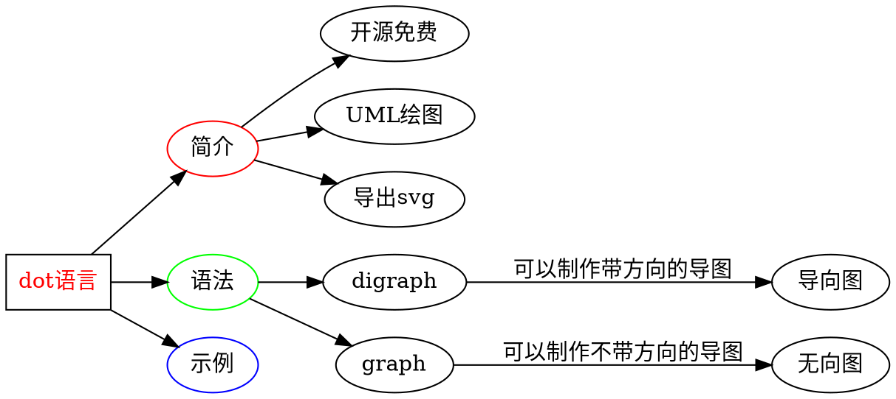

# Graphviz

```dot
digraph g {
    rankdir=LR  //方向左右
    dot语言->{简介,语法,示例}
    dot语言[shape=box,fontcolor=red]
    简介[color=red]
    语法[color=green]
    示例[color=blue]
    简介->{开源免费,UML绘图,导出svg}
    语法->{"digraph","graph"}
    "digraph"->导向图[label=可以制作带方向的导图]
    "graph"->无向图[label=可以制作不带方向的导图]
    }
```
