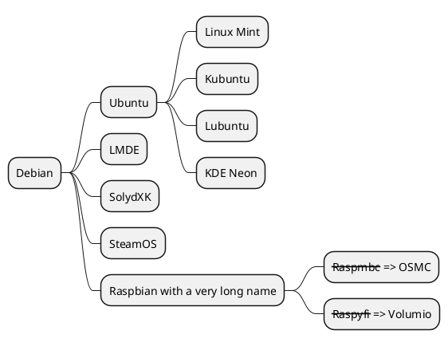
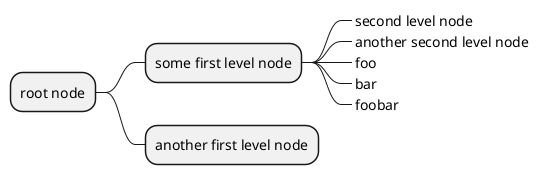
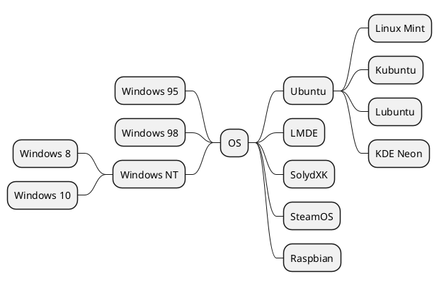
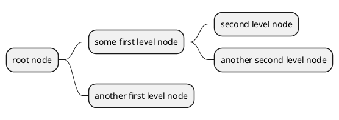
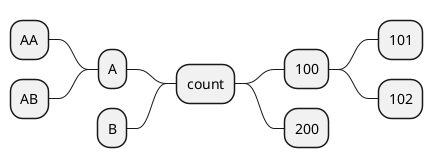
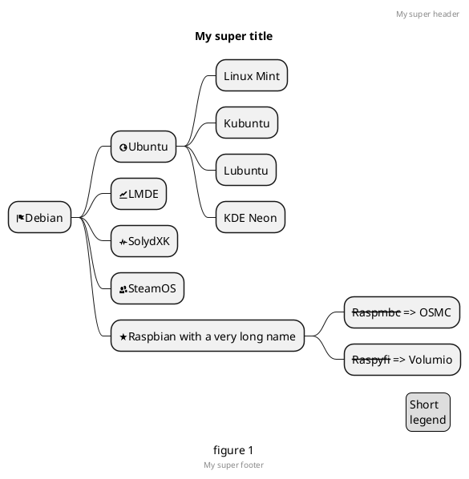

---
toc:
  depth_from: 2
  depth_to: 4
  ordered: false
---

# MPE PlantUML脑图

[TOC]

## PlantUML脑图

### 兼容OrgMode语法

```plantuml
@startmindmap
* Debian
** Ubuntu
*** Linux Mint
*** Kubuntu
*** Lubuntu
*** KDE Neon
** LMDE
** SolydXK
** SteamOS
** Raspbian with a very long name
*** <s>Raspmbc</s> => OSMC
*** <s>Raspyfi</s> => Volumio
@endmindmap
```

你可以用下划线去除外边框。

```plantuml
@startmindmap
* root node
** some first level node
***_ second level node
***_ another second level node
***_ foo
***_ bar
***_ foobar
** another first level node
@endmindmap
```

你可以使用下面的运算符来决定图形方向。

```plantuml
@startmindmap
+ OS
++ Ubuntu
+++ Linux Mint
+++ Kubuntu
+++ Lubuntu
+++ KDE Neon
++ LMDE
++ SolydXK
++ SteamOS
++ Raspbian
-- Windows 95
-- Windows 98
-- Windows NT
--- Windows 8
--- Windows 10
@endmindmap
```

### 兼容Markdown语法

```plantuml
@startmindmap
* root node
	* some first level node
		* second level node
		* another second level node
	* another first level node
@endmindmap
```

你可以同时使用图形的左右两侧

```plantuml
@startmindmap
* count
** 100
*** 101
*** 102
** 200

left side

** A
*** AA
*** AB
** B
@endmindmap
```

```plantuml
@startmindmap
caption figure 1
title My super title

* <&flag>Debian
** <&globe>Ubuntu
*** Linux Mint
*** Kubuntu
*** Lubuntu
*** KDE Neon
** <&graph>LMDE
** <&pulse>SolydXK
** <&people>SteamOS
** <&star>Raspbian with a very long name
*** <s>Raspmbc</s> => OSMC
*** <s>Raspyfi</s> => Volumio

header
My super header
endheader

center footer My super footer

legend right
  Short
  legend
endlegend
@endmindmap
```
