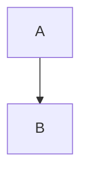
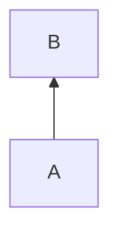
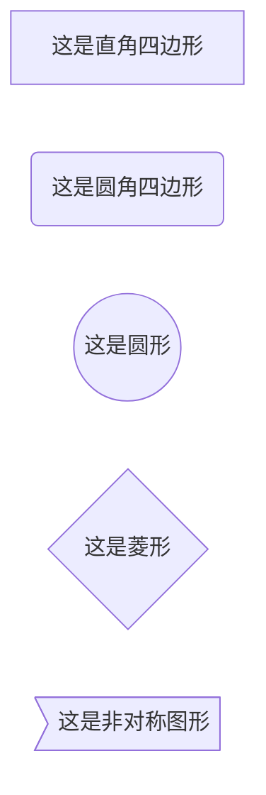
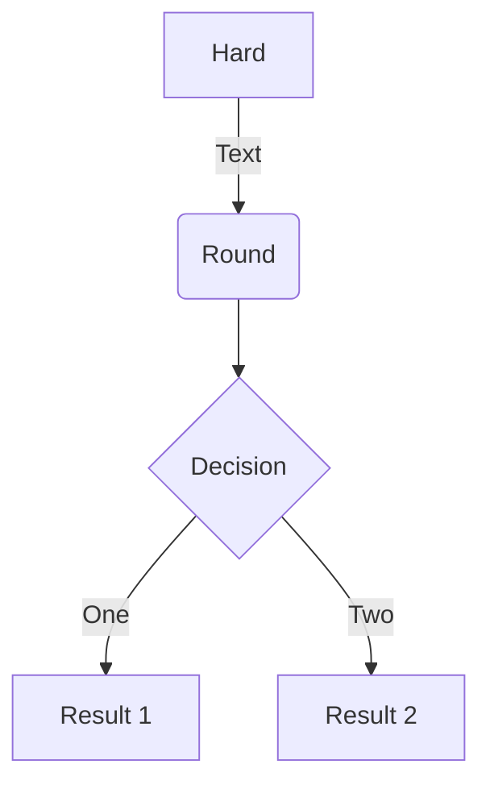
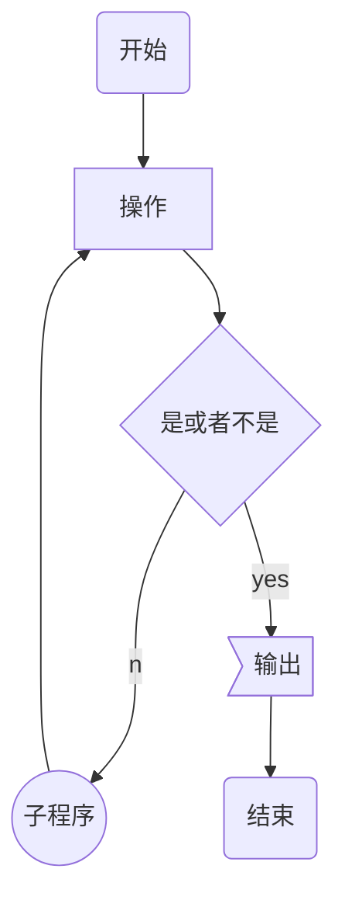

---
toc:
  depth_from: 2
  depth_to: 4
  ordered: false
---

# MPE

[TOC]

## Mermaid流程图

### 指定方向






### 节点形状



### 连线

    箭头连接  A1–->B1
    开放连接  A2---B2
    标签连接  A3–-text—--B3 或者 A4---|text|B4
    箭头标签连接  A5--text-->B5 或者 A6-->|text|B6
    虚线开放连接  A7.-B7 或者 A8-.-B8 或者 A9..-B9
    虚线箭头连接  A10.->B10 或者 A11-.->B11 或者 A12..->B12
    标签虚线连接  A13-.text.-B13
    标签虚线箭头连接  A14-.text.->B14
    粗线开放连接  A15===B15
    粗线箭头连接  A16==>B16
    标签粗线开放连接  A17==text===B17
    标签粗线箭头连接  A18==text==>B18

```mermaid
graph LR
A1-->B1
A2---B2
A3--text---B3
A4---|text|B4
A5--text-->B5
A6-->|text|B6
A7.-B7
A8-.-B8
A9..-B9
A10.->B10
A11-.->B11
A12..->B12
A13-.text.-B13
A14-.text.->B14
A15===B15
A16==>B16
A17==text===B17
A18==text==>B18
```





