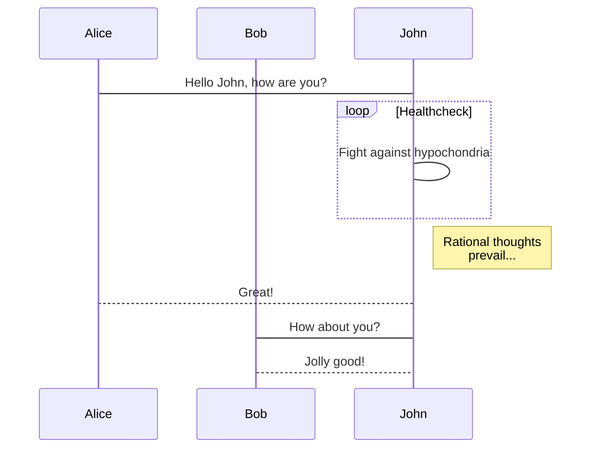
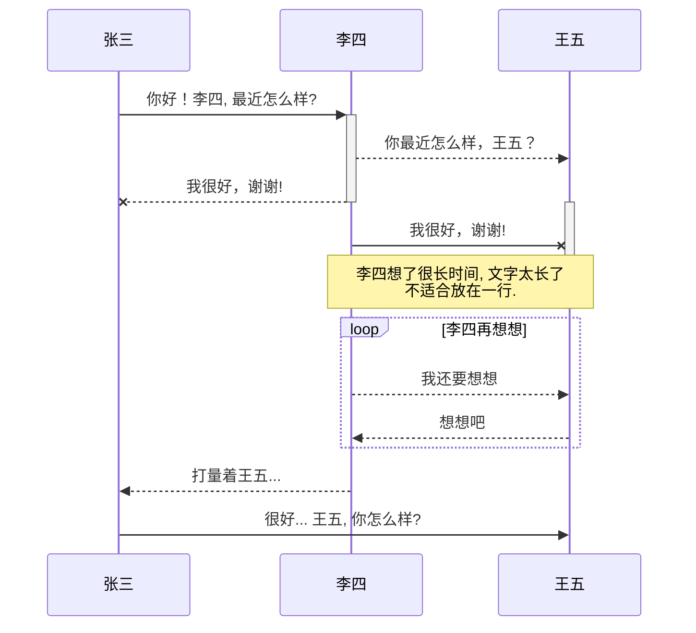
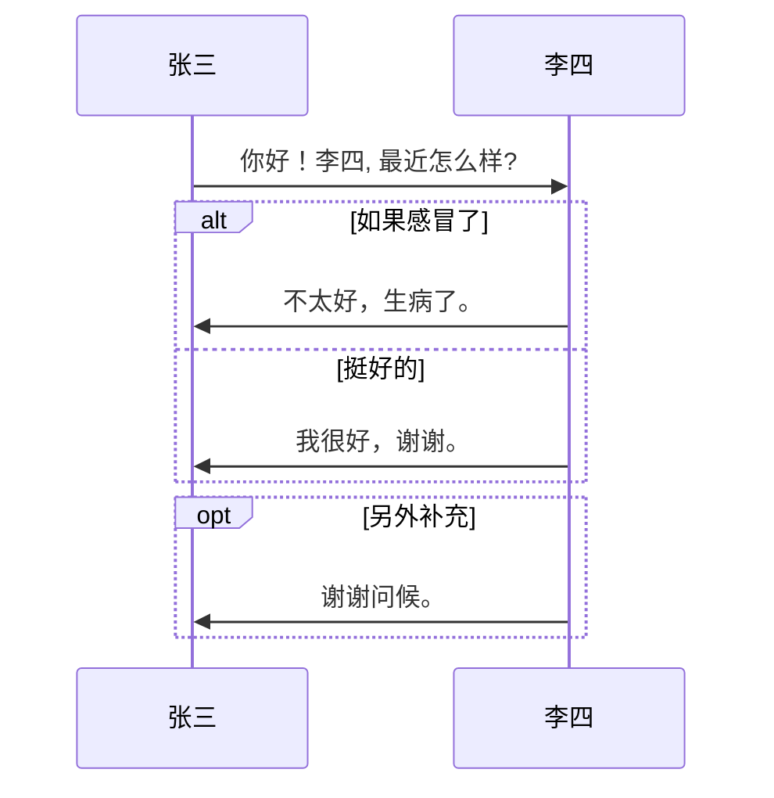
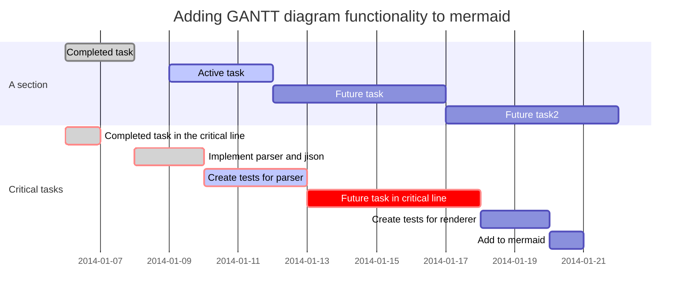
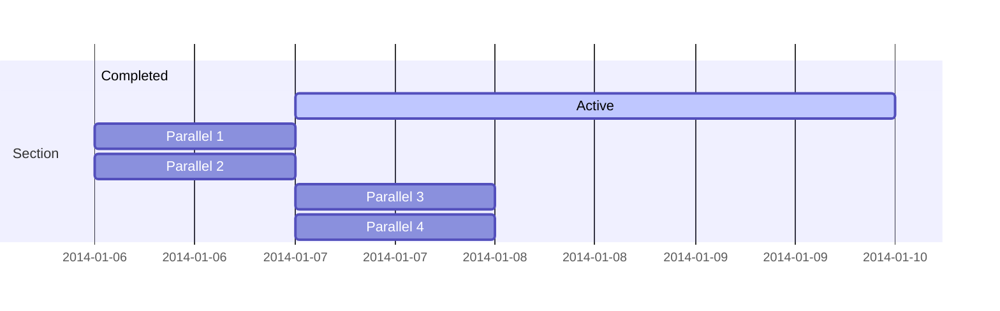
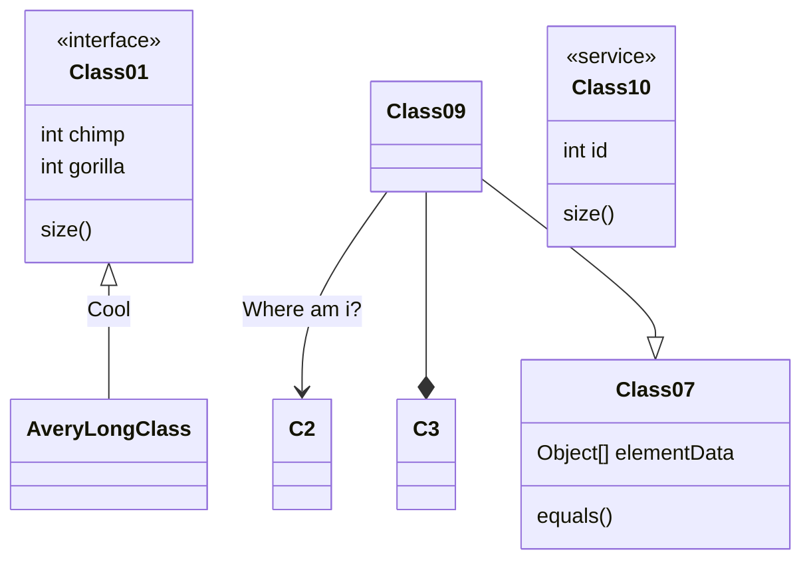
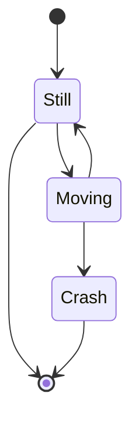
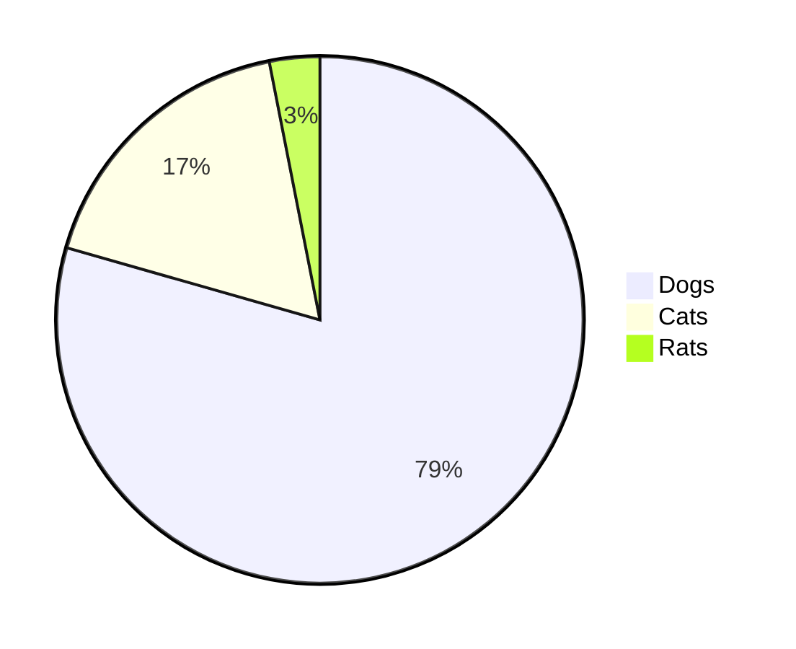

---
toc:
  depth_from: 2
  depth_to: 4
  ordered: false
---

# Mermaid

[TOC]

VS Code默认主题下，Mermaid Theme默认主题是dark，显示效果有问题，我设置为forset。

## Mermaid时序图

```mermaid
sequenceDiagram
    participant Alice
    participant Bob
    Alice->John: Hello John, how are you?
    loop Healthcheck
        John->John: Fight against hypochondria
    end
    Note right of John: Rational thoughts <br/>prevail...
    John-->Alice: Great!
    John->Bob: How about you?
    Bob-->John: Jolly good!
```

```mermaid
    sequenceDiagram
    participant 张 as 张三
    participant 李 as 李四
    participant 王 as  王五
    张 ->> +李: 你好！李四, 最近怎么样?
    李-->> 王: 你最近怎么样，王五？
    李--x -张: 我很好，谢谢!
    activate 王
    李-x 王: 我很好，谢谢!
    Note over 李,王: 李四想了很长时间, 文字太长了<br/>不适合放在一行.
    deactivate 王
    loop 李四再想想
        李-->>王: 我还要想想
        王-->>李: 想想吧
    end
    李-->>张: 打量着王五...
    张->>王: 很好... 王五, 你怎么样?
```

```mermaid
    sequenceDiagram
    participant 张 as 张三
    participant 李 as 李四
    张 ->> 李: 你好！李四, 最近怎么样?
    alt 如果感冒了
        李->> 张: 不太好，生病了。
        else 挺好的
        李->> 张: 我很好，谢谢。
    end
    opt 另外补充
        李->> 张: 谢谢问候。
    end
```

## Mermaid甘特图

```mermaid
gantt
    dateFormat  YYYY-MM-DD
    title Adding GANTT diagram functionality to mermaid
    section A section
    Completed task            :done,    des1, 2014-01-06,2014-01-08
    Active task               :active,  des2, 2014-01-09, 3d
    Future task               :         des3, after des2, 5d
    Future task2              :         des4, after des3, 5d
    section Critical tasks
    Completed task in the critical line :crit, done, 2014-01-06,24h
    Implement parser and jison          :crit, done, after des1, 2d
    Create tests for parser             :crit, active, 3d
    Future task in critical line        :crit, 5d
    Create tests for renderer           :2d
    Add to mermaid                      :1d
```

```mermaid
gantt
section Section
Completed :done,    des1, 2014-01-06,2014-01-08
Active        :active,  des2, 2014-01-07, 3d
Parallel 1   :         des3, after des1, 1d
Parallel 2   :         des4, after des1, 1d
Parallel 3   :         des5, after des3, 1d
Parallel 4   :         des6, after des4, 1d
```

类图

```mermaid
classDiagram
Class01 <|-- AveryLongClass : Cool
<<interface>> Class01
Class09 --> C2 : Where am i?
Class09 --* C3
Class09 --|> Class07
Class07 : equals()
Class07 : Object[] elementData
Class01 : size()
Class01 : int chimp
Class01 : int gorilla
class Class10 {
  <<service>>
  int id
  size()
}
```

状态图

```mermaid
stateDiagram
[*] --> Still
Still --> [*]
Still --> Moving
Moving --> Still
Moving --> Crash
Crash --> [*]
```

饼图

```mermaid
pie
"Dogs" : 386
"Cats" : 85
"Rats" : 15
```
